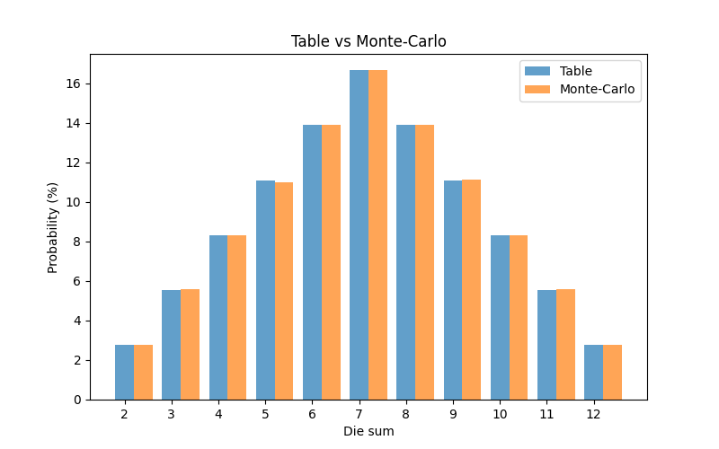

Таблиця порівняння аналітичних ймовірностей та результатів методу Монте-Карло:

| Сума | Таблиця (аналітична) | Monte-Carlo (симуляція) | Різниця |
| --- | --- | --- | --- |
| 2    | 2.78%               | 2.77%                  | -0.01%  |
| 3    | 5.56%               | 5.55%                  | -0.01%  |
| 4    | 8.33%               | 8.37%                  | 0.04%   |
| 5    | 11.11%              | 11.09%                 | -0.02%  |
| 6    | 13.89%              | 13.90%                 | 0.02%   |
| 7    | 16.67%              | 16.72%                 | 0.05%   |
| 8    | 13.89%              | 13.83%                 | -0.06%  |
| 9    | 11.11%              | 11.11%                 | 0.00%   |
| 10   | 8.33%               | 8.32%                  | -0.02%  |
| 11   | 5.56%               | 5.56%                  | 0.00%   |
| 12   | 2.78%               | 2.78%                  | 0.00%   |

## Графічне представлення

Для наочності побудовано відображення ймовірностей:
 

## Висновки

* Результати моделювання методом Монте-Карло дуже близькі до аналітичних ймовірностей.
* Найчастіше випадає сума **7**, що відповідає теоретичним розрахункам.
* Невеликі розбіжності (±0.06%) пояснюються випадковим характером експерименту.
* Метод Монте-Карло є ефективним для оцінки ймовірностей випадкових подій та може застосовуватися для складніших систем, де аналітичні розрахунки складні або неможливі.

